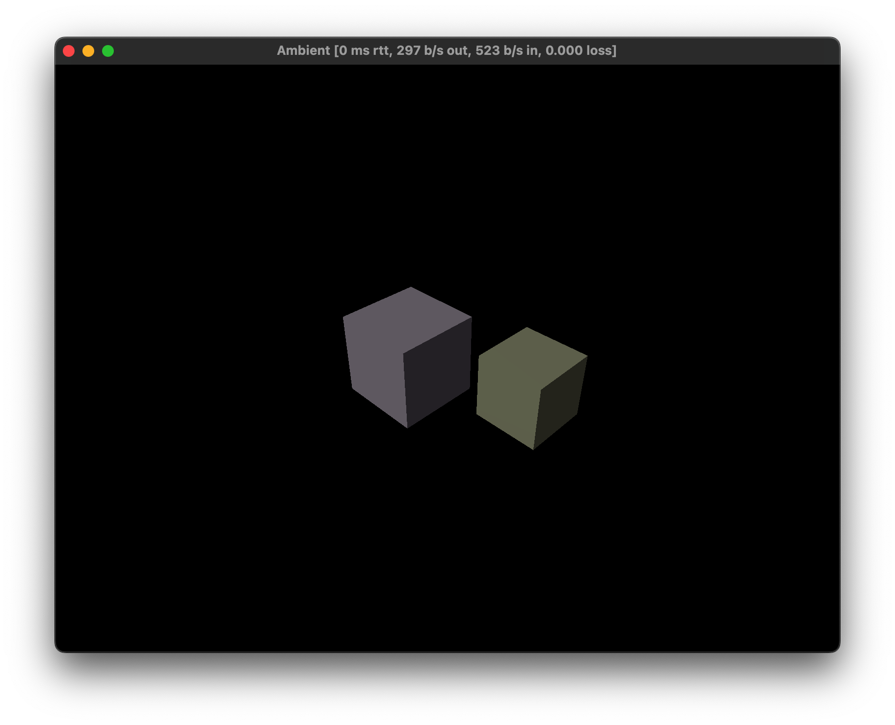

# Chapter 3 Spawn query

The query system is a powerful tool to get information about the game world. It is used to get information about the player, the game world, and the entities in the game world.

There are three types of queries in Ambient so far:

- `spawn_query` - often bind to a function that runs once when the entity is spawned
- `query` - often bind to a function that runs every frame
- `change_query` - often bind to a function that runs when a component changes

Take `spawn_query` for example: we `spawn_query` one of many components and bind it to a callback function, which will be called when the entity that contains the queried components is spawned. The callback function will be called with the entity as the first argument and the queried components as the rest of the arguments.

In the code example in this chapter, we will use `spawn_query` to check if a new player is spawned:

```rust
spawn_query((is_player(), user_id())).bind(|result| {
    for (e, states) in result {
        println!("Player: {:?}", e);
        println!("States: {:?}", states);
        Entity::new()
            .with_merge(make_transformable())
            .with(cube(), ())
            .with(color(), random::<Vec3>().extend(0.8)) // with extend, Vec3 becomes Quat
            .with(translation(), random::<Vec3>() * 3.)
            .spawn();
    }
});
```

When a new player is spawned, we will spawn a cube with a random color and a random position.

You can run the project with `ambient run` and run `ambient join` in another terminal to see the result:



For the other two types of queries, we will cover them in the later chapters.
