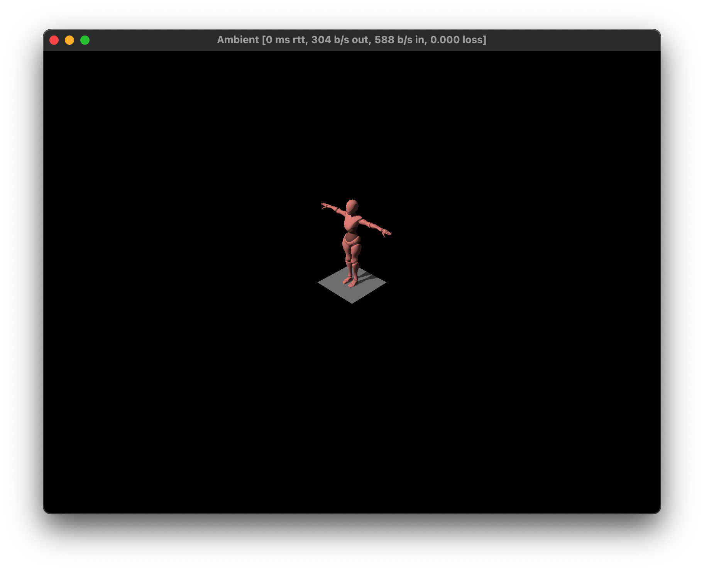

# Chapter 7 Model import

Let's add some models to replace the color cube.

First, choose a model from [mixamo.com](https://www.mixamo.com/#/?page=1&type=Character).

Download it with `FBX Binary` and `T-pose`.

Type `ambient assets import` in your terminal and then drag and drop a model file after the command:

```shell
ambient assets import '/Users/chaosprint/Downloads/X Bot.fbx'
```

> you should see a different path based on your machine

Ideally, this command will create a folder called `./assets` and there is a `pipeline.toml` inside.

> To know more about `pipeline`, read it [here](https://ambientrun.github.io/Ambient/reference/asset_pipeline.html).

Then in the code, you can use `prefab_from_model` component to use this model.

Replace the `.with(cube(), ())` with the following:

```rust
.with(
    prefab_from_url(),
    assets::url("X Bot.fbx"),
)
```

> Note that you need to declare in Rust that you want to use `assets` first.

You should be able to see the model in the scene and you can move it around with WASD:


