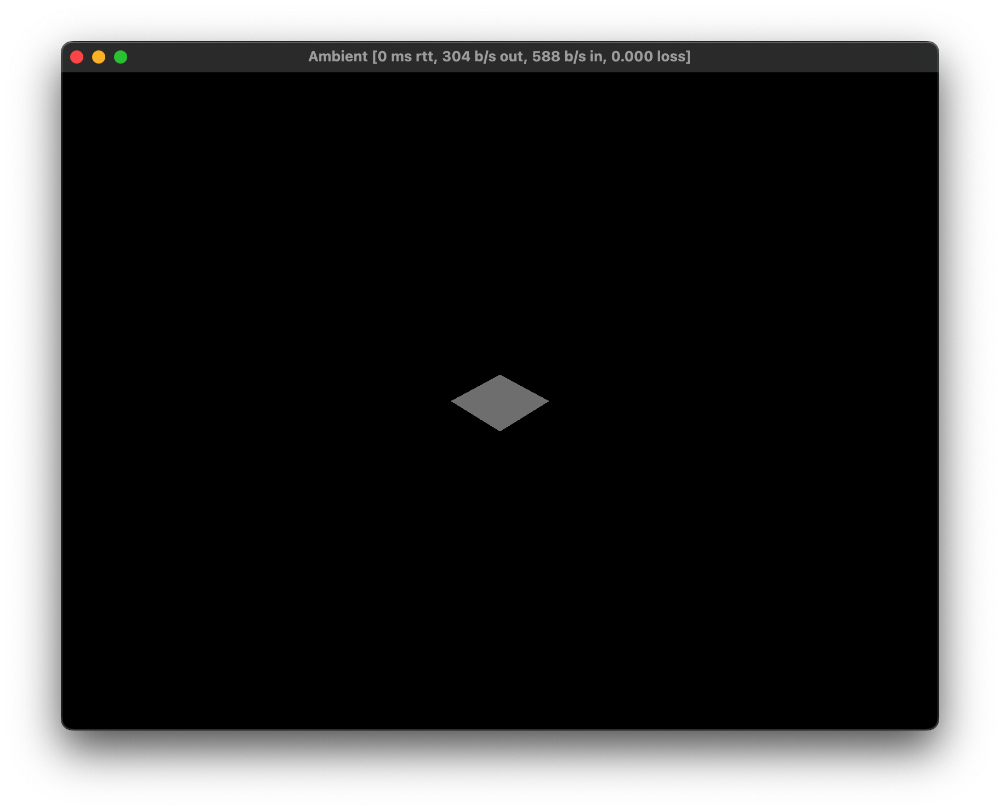
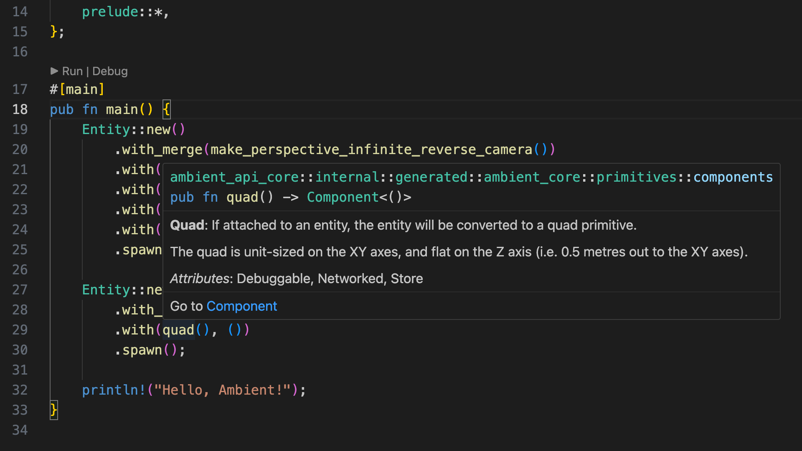

# Chapter 1 Project structure

What you see now is the default template created with `ambient new`.

We write most of the game logic in `client.rs` and `server.rs`.

> Read more here about [where my code should go](https://ambientrun.github.io/Ambient/reference/faq.html#should-my-code-go-on-the-client-or-the-server)?

In `ambient.toml` we define some messages and components for the engine.

> You can read more about ECS [here](https://ambientrun.github.io/Ambient/reference/ecs.html).

In `Cargo.toml` we config Rust-related settings. For example, we often need to keep an eye on the version of `ambient_api` in `Cargo.toml`.

## Run the project

You can run the project with `ambient run`.

Ideally, you will see a Window popping out like this:



## Modify the code

Let's have a look at `client.rs` and `server.rs`.

`client.rs` is almost empty. In this case, we can delete it. And comment out the relevant part in `Cargo.toml`:

```toml

# [[bin]]
# name = "client_tutorial"
# path = "src/client.rs"
# required-features = ["client"]

[[bin]]
name = "server_tutorial"
path = "src/server.rs"
required-features = ["server"]

[features]
client = ["ambient_api/client"]
server = ["ambient_api/server"]

```

In the `server.rs`, we created two entities: a camera and a plane(quad).

If you have installed all the recommended VS Code tools in the introduction page, you should be able to hover your mouse over each concept or component to see the docs:



## Challenge

Try to create some cubes and change their `translation()`, `scale()`, `rotation()` components.

> Hint: You need to have `.with_merge(make_transformable())` to be able to make those components effective.

> Tip: You can refer to the [primitives example](https://github.com/AmbientRun/Ambient/blob/main/guest/rust/examples/basics/primitives/src/server.rs) in the Ambient main GitHub repository.
